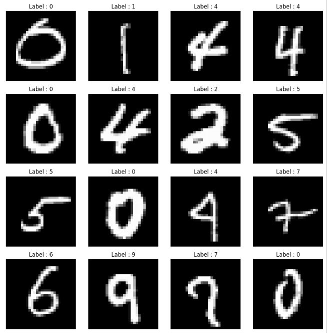
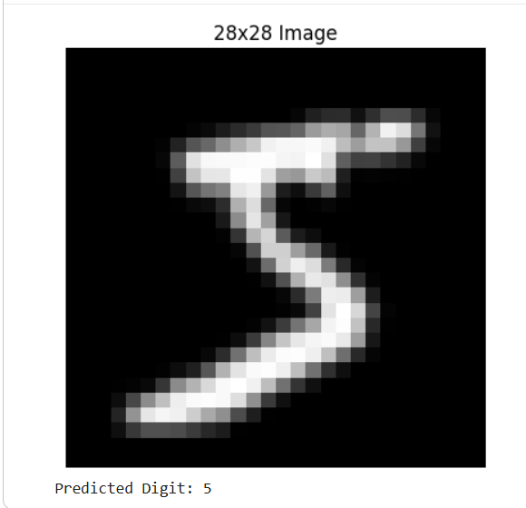

# MNIST Digit Classification using Convolutional Neural Networks (CNN)

## Project Overview

This project is my implementation of a Convolutional Neural Network (CNN) using PyTorch to classify handwritten digits from the MNIST dataset.

The goal of this project was to understand the complete deep learning workflow, starting from loading and preprocessing the dataset to training, evaluating, and testing a CNN model on handwritten digit images.

---

## Project Preview

The following image shows a sample of handwritten digits from the MNIST dataset.

---

## Dataset

The project uses the MNIST handwritten digits dataset.

Dataset Information:

1. 60,000 training images
2. 10,000 testing images
3. Image size: 28 × 28 pixels
4. 10 output classes (Digits 0–9)

---

## Technologies Used

1. Python
2. PyTorch
3. Torchvision
4. NumPy
5. Matplotlib
6. Pillow

---

## Project Workflow

During this project, I implemented the following steps:

1. Loading the MNIST dataset
2. Preprocessing the images
3. Creating DataLoaders
4. Building a CNN model from scratch
5. Training the model
6. Evaluating the model
7. Predicting handwritten digits
8. Saving the trained model

---

## CNN Architecture

The CNN model consists of:

1. Convolution Layer (32 Filters)
2. ReLU Activation
3. Max Pooling Layer
4. Convolution Layer (64 Filters)
5. ReLU Activation
6. Max Pooling Layer
7. Flatten Layer
8. Fully Connected Layer (128 Neurons)
9. Output Layer (10 Classes)

---

## Training Configuration

1. Batch Size: 64
2. Learning Rate: 0.001
3. Optimizer: Adam
4. Loss Function: CrossEntropyLoss
5. Epochs: 5

---

## Model Performance

After training, the model was evaluated using the MNIST test dataset.

Test accuracy = 99.06%

The following screenshot shows the final test accuracy achieved by the model.

---

## Custom Prediction

The trained model can predict handwritten digits from custom images after:

1. Converting the image to grayscale
2. Resizing it to 28 × 28 pixels
3. Converting it into a tensor
4. Feeding it to the trained model

The following example shows a prediction made by the trained model.

---

## Test Images

The repository also includes several handwritten digit images used to test the trained model.

These images are available in the **test_images** folder.

---

## Future Improvements

1. Improve image preprocessing for handwritten digits captured with a camera.
2. Add GPU support to speed up model training.
3. Train a deeper CNN architecture.
4. Add Batch Normalization.
5. Add Dropout layers to reduce overfitting.
6. Build a Streamlit web application for interactive predictions.
7. Deploy the model online.

---

## Author

**Mohamed Gamal**

Machine Learning & Deep Learning Engineer

GitHub: https://github.com/mogamal1111

LinkedIn: https://www.linkedin.com/in/mohamed-gamal-85795735b
